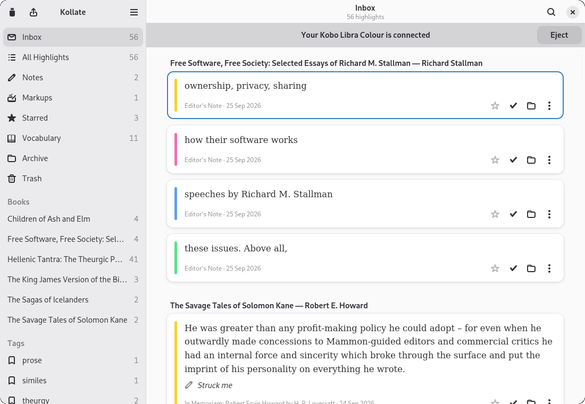
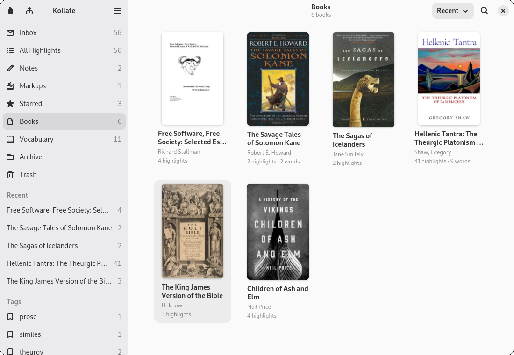
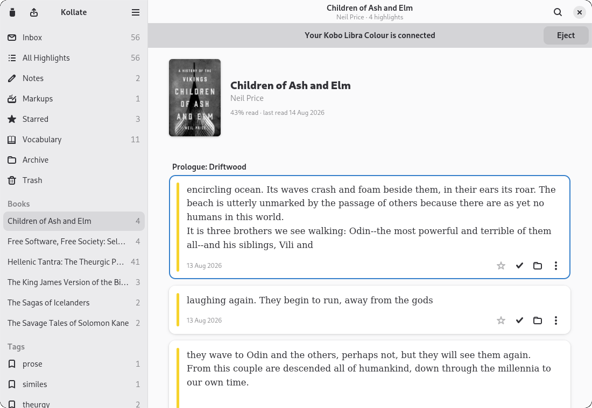
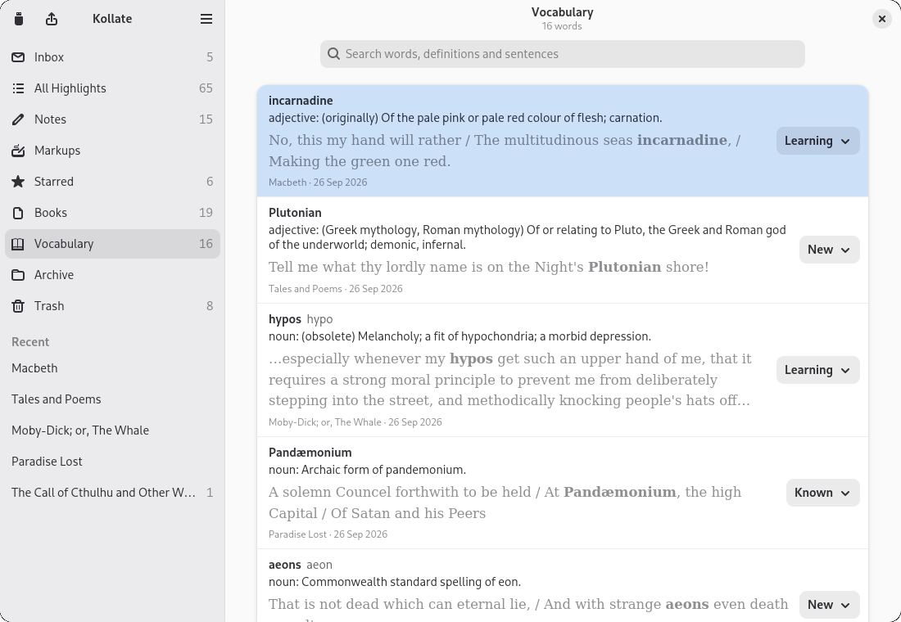
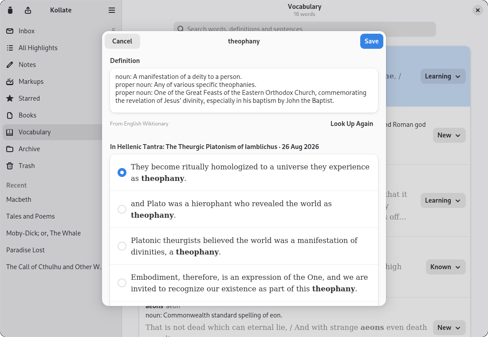
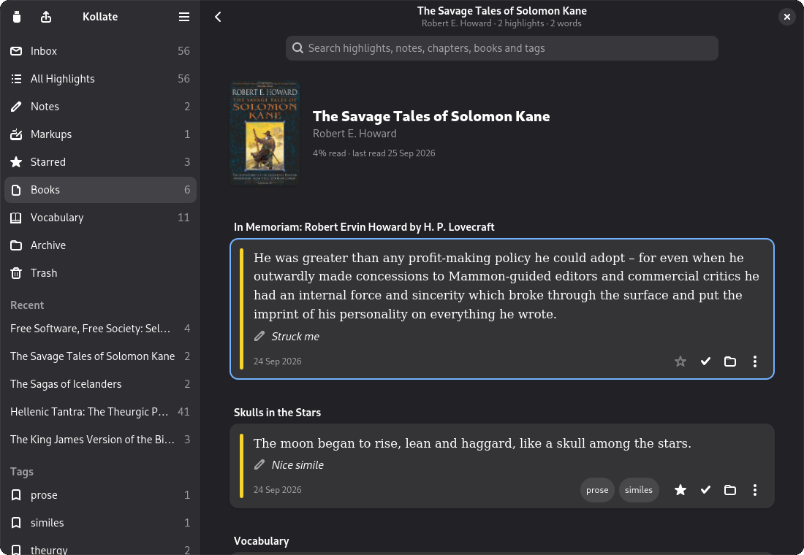
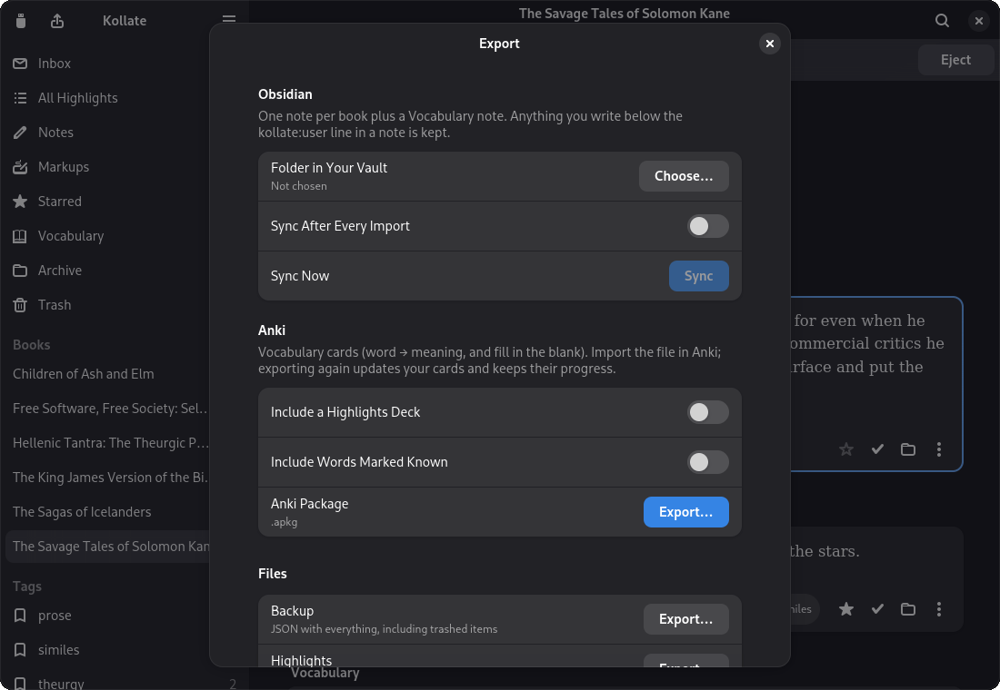

<p align="center">
  
</p>

<h1 align="center">Kollate</h1>

<p align="center">
  Collect and curate the highlights, notes and vocabulary from your Kobo e-reader.<br>
  A native GNOME app for Linux. Offline, read-only on your device, and free of duplicates.
</p>

<p align="center">
  
</p>

## What it does

Plug in your Kobo and Kollate imports everything you've marked while reading:

- **Highlights and notes**, in all four Kobo colours, sorted into chapters in reading order.
- **Handwritten markups** from stylus models (tested on the Libra Colour), shown as the page image the Kobo saved.
- **Vocabulary Builder words.** Kollate goes further than the Kobo here: it finds the sentence you looked each word up in, inside the book itself, and adds an offline dictionary definition.

Then you curate:

- An **Inbox** of new highlights you can triage from the keyboard: `K` keep, `A` archive, `S` star (starring also keeps), `E` edit, `Delete` trash.
- **Bulk actions:** select several highlights (Ctrl- or Shift-click, Shift+↑/↓, Ctrl+A) and keep, archive, star or trash them together, or **Keep All** in the Inbox. Every action can be undone. Press **Ctrl+?** to see all keyboard shortcuts.
- A **Books** page of covers, sorted by most recently read (or title, or author), with your five latest books always one click away in the sidebar.
- **Star, tag, archive** and **search** everything: the search field at the top of every page filters highlights, books or words.
- **Fix typos or rewrite notes.** Kollate keeps the Kobo's original and can restore it.
- **Pick the right context sentence** and edit definitions for each word, and track words as *New*, *Learning*, *Known* or *Ignored*.

And export:

- **Obsidian:** one note per book plus a Vocabulary note, synced into your vault (optionally after every import). Highlights can be linked individually, and anything you write under the `%% kollate:user` line is kept.
- **Anki:** a vocabulary deck (word → meaning, plus fill-in-the-blank from the book's sentence) and an optional highlights deck. Exporting again updates your cards without losing study progress.
- **JSON** backup, **CSV** (highlights or vocabulary) and **Readwise** CSV.

## Screenshots

| | |
|---|---|
|  |  |
| **Books:** your library by cover, most recent first | **A book:** cover, progress, highlights by chapter |
|  |  |
| **Vocabulary:** definition and the sentence from your book | **Words:** pick the context, edit the definition |
|  |  |
| **Dark mode**, tags and stars | **Export** to Obsidian, Anki and files |

## Your Kobo stays untouched, and nothing goes online

- Kollate **never writes to your Kobo.** It copies the Kobo's database to a temporary folder and reads the copy, so you can eject at any time. The Flatpak enforces this: its sandbox can only read the Kobo.
- **No duplicates, ever.** Highlights are matched by the Kobo's own IDs, and by content if the IDs change (a factory reset, a second device, or calibre re-sending a book). Re-importing the same Kobo changes nothing.
- **Your library is the source of truth.** Highlights you delete on the Kobo stay in Kollate, flagged "deleted on Kobo" and gathered in a *Deleted on Kobo* view. If you prefer, they can go to Kollate's Trash instead (Preferences), and they come back if they reappear on the Kobo. If you've edited something in Kollate and it later changes on the Kobo, your version wins and the Kobo's is kept alongside it.
- **Fully offline.** Definitions come from the bundled [Open English WordNet](https://en-word.net). You can add StarDict dictionaries or [kaikki.org](https://kaikki.org) Wiktionary extracts in Preferences.

## Install

Download from the [latest release](https://github.com/andrew-lawlor/kollate/releases/latest).

### Flatpak (any distribution)

```sh
flatpak install --user kollate.flatpak
flatpak run io.github.andrew_lawlor.Kollate
```

The bundle uses the GNOME 51 runtime from Flathub, and Flatpak installs it automatically. The sandbox only gets **read-only** access to `/media` and `/run/media`, where the Kobo is mounted, plus access to gvfs so it can notice the Kobo and eject it. It gets no network access. The Flatpak keeps its library in `~/.var/app/io.github.andrew_lawlor.Kollate/data/kollate/`.

### Debian / Ubuntu (.deb)

```sh
sudo apt install ./kollate_0.1.0-1_amd64.deb
```

The package includes the app, the `kollate-cli` tool and the WordNet dictionary. It needs GTK ≥ 4.12 and libadwaita ≥ 1.5, which Debian 13 and Ubuntu 24.04 or newer provide.

### Building the packages

```sh
./scripts/build-deb.sh       # target/debian/kollate_<version>_amd64.deb
./scripts/build-flatpak.sh   # installs for your user; bundle in target/flatpak/kollate.flatpak
```

`build-flatpak.sh` needs `org.gnome.Sdk//51`, `org.freedesktop.Sdk.Extension.rust-stable//26.08` and `org.flatpak.Builder` from Flathub. After changing `Cargo.lock`, regenerate `flatpak/cargo-sources.json` with [flatpak-cargo-generator](https://github.com/flatpak/flatpak-builder-tools/tree/master/cargo).

### From source

```sh
# Debian/Ubuntu build dependencies (plus Rust from https://rustup.rs)
sudo apt install build-essential pkg-config libgtk-4-dev libadwaita-1-dev

./scripts/fetch-wordnet.sh      # one-time: download and build the dictionary (~24 MB)
cargo run --release -p kollate
```

## Usage

1. Start Kollate and connect your Kobo with a USB cable. Choose *Connect* on the Kobo if it asks.
2. Kollate spots the Kobo and imports it automatically. You can change this in *Preferences*: *Ask first* or *Do nothing*.
3. Work through the **Inbox**, browse by book or tag, and visit **Vocabulary**.
4. Open **Export** (`Ctrl+E`), pick a folder in your Obsidian vault and/or export an Anki deck.
5. Press **Eject** in the banner when you're done.

Your library lives in `~/.local/share/kollate/` (`~/.var/app/io.github.andrew_lawlor.Kollate/data/kollate/` for the Flatpak).

### Command line

`kollate-cli` does the same work from a terminal:

```sh
kollate-cli inspect /media/$USER/KOBOeReader          # show what's on the Kobo (read-only)
kollate-cli import  /media/$USER/KOBOeReader --dry-run
kollate-cli import  /media/$USER/KOBOeReader
kollate-cli library                                    # what's in your library
kollate-cli contexts /media/$USER/KOBOeReader          # context sentences for vocab words
kollate-cli export obsidian ~/Vault/Books
kollate-cli export anki Kollate.apkg --highlights
kollate-cli dict build-stardict ~/dicts/foo.ifo foo.db # convert a dictionary
```

## Compatibility

Developed and tested on a **Kobo Libra Colour** (firmware 4.45, database version 176). Other Kobo models use the same database layout and should work, but they aren't tested yet; reports are welcome. Context sentences need sideloaded, DRM-free books. Kobo Store books with DRM still import, just without context sentences.

## Development

```
crates/
  kollate-core/   Kobo reader, library (SQLite), import/dedup, dictionaries, EPUB context, exports
  kollate-cli/    command-line tool
  kollate/        GTK 4 / libadwaita app
tests/fixtures/   a trimmed Kobo database used by the tests
SPEC.md           design notes, data model and what was verified on a real device
```

```sh
cargo test          # unit and integration tests, including against a real Kobo database
cargo clippy --all-targets
```

## License

Kollate is free software under the **GNU General Public License v3.0 or later**; see [LICENSE](LICENSE).

Definitions come from **Open English WordNet** © Princeton University and the Open English WordNet contributors, under [CC BY 4.0](https://creativecommons.org/licenses/by/4.0/).

Kollate isn't affiliated with or endorsed by Rakuten Kobo. "Kobo" is a trademark of Rakuten Kobo Inc.
