<p align="center">
  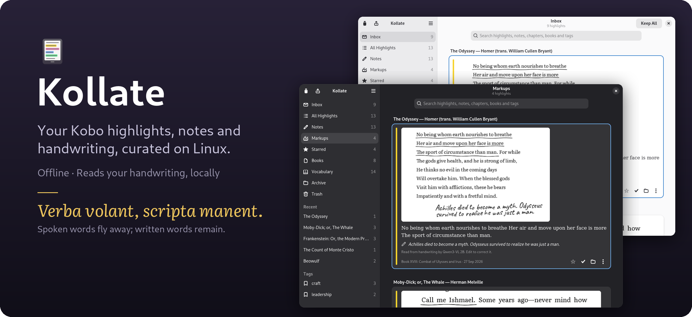
</p>

<p align="center">
  <b>Everything you mark on your e-reader, read, sorted and put to work.</b><br>
  Highlights and notes from your Kobo, in its own reader or in KOReader. Kollate turns your margin notes<br>
  and notebooks into text, files what you star and tag with the pen, and makes flashcards from the words you look up.<br>
  <sub>A native Linux app for GNOME and any desktop. Offline, private, and it never writes to your e-reader.</sub>
</p>

<p align="center">
  <a href="https://github.com/andrew-lawlor/kollate/releases/latest"><b>Download</b></a> ·
  <a href="docs/guide.md"><b>User guide</b></a> ·
  <a href="SPEC.md">Design notes</a>
</p>

<p align="center"><i>"It is a comforting thing to have an archive: a place where the scattered leaves of memory are bound together."</i></p>

E-readers are wonderful to read on, and stingy with what you write in them: highlights locked in a database, handwriting kept only as ink, notes split between readers. Kollate gathers all of it into one searchable library on your own computer, with no account and no cloud, and without sending a word of your notes anywhere.

Here's what it does, over a week of reading, starting with what nothing else does.

## Your handwriting, read as text

Write in the margin with a stylus Kobo, and Kollate reads it. Your notes become searchable text, and what you underlined or circled comes from the book itself, word for word, down to its punctuation. A small AI model does the reading on your own computer: nothing goes online, and anything it misreads is yours to correct.

<p align="center">
  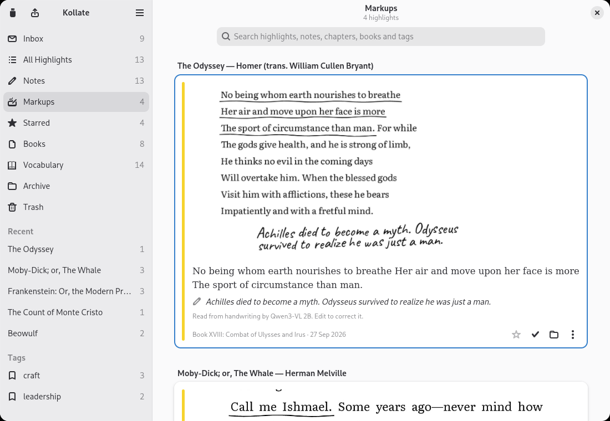
</p>
<p align="center">
  <i>Monday, Book XVIII of the Odyssey: a passage underlined, a thought in the margin. Kollate reads both.</i>
</p>

## Curate with the pen

Most tools make you sort your highlights afterwards, at a desk. With Kollate you can do it while you read, the way readers always have: with a mark in the margin. Kollate reads the mark along with your handwriting, and does the filing.

| In the margin | In Kollate |
|---|---|
| `*` (or a drawn star), or `NB` | Starred |
| `?` | Tagged `question`: a list of passages to look into |
| `#leadership` | Tagged `leadership` |
| A circled word | Added to Vocabulary, with the book's sentence and a definition |
| A circled word, with a note beside it | …and the note becomes your **gloss** on the word |

| | |
|---|---|
| 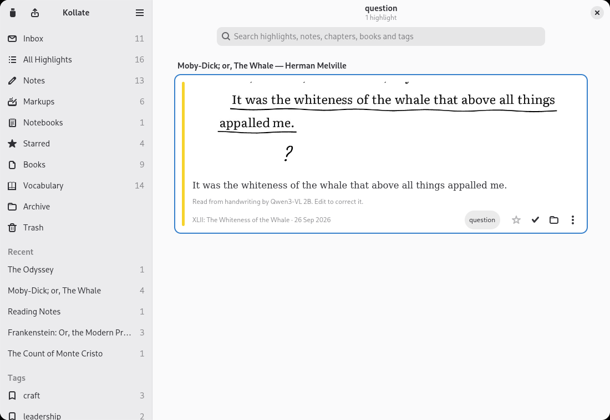 | 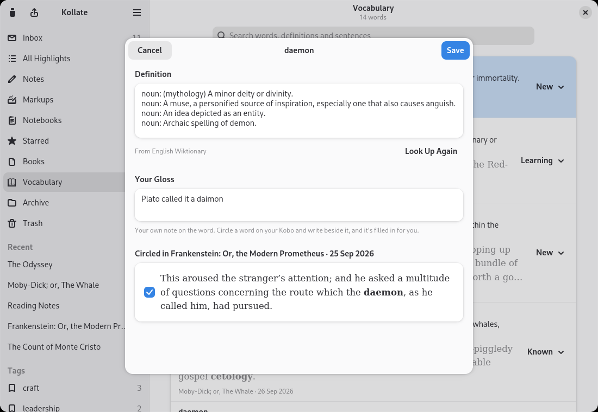 |
| *Tuesday: a `?` beside Melville's white whale files the passage under `question`…* | *…and "daemon", circled in Frankenstein, arrives in Vocabulary with the gloss written beside it.* |

**No stylus? You still get most of it.** On any Kobo, type the same marks as a highlight's note (`#leadership`, `NB`, `?`) and Kollate files it the same way. Everything else on this page, from vocabulary to exports, works on every Kobo.

Marks take effect once: unstar or untag something in Kollate and it stays that way. It's an old habit made new: the asterisk began as the *asteriskos*, the "little star" Alexandria's librarians put beside lines of Homer; *nota bene* and *quaere* filled medieval margins; and a *gloss*, a hard word's meaning written beside it, gave us the glossary. The [user guide](docs/guide.md#mark-it-in-the-margin) has the details.

## Notebooks, Basic and Advanced

Stylus Kobos have a notebook app. The Kobo turns handwriting into text only in *Advanced* notebooks, and only when you ask. Kollate reads both kinds, every page, on its own: your ink redrawn, with the writing as text below it and drawings left out.

<p align="center">
  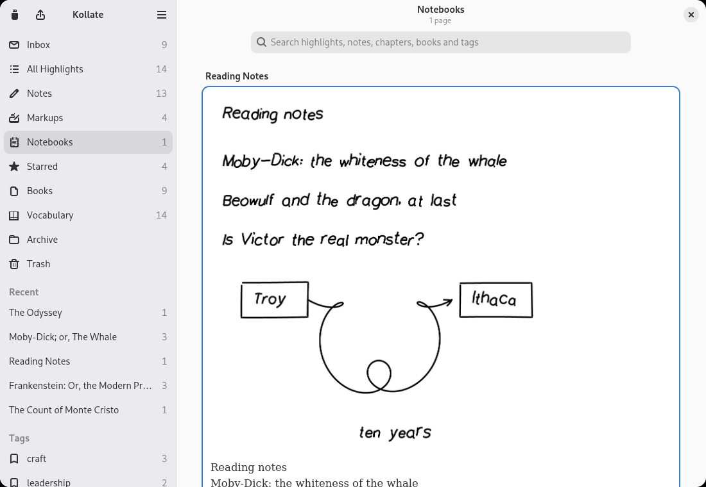
</p>
<p align="center"><i>Wednesday: reading notes, and a map of Odysseus's long way home.</i></p>

## Every word, in the sentence you met it

The Kobo's Vocabulary Builder keeps the words you look up, but not where you met them. Kollate finds the sentence in the book, adds a definition from an offline dictionary (the English Wiktionary is built in), and tracks each word as *New*, *Learning* or *Known*. Then it makes Anki flashcards from them, which update without losing your progress.

| | |
|---|---|
| 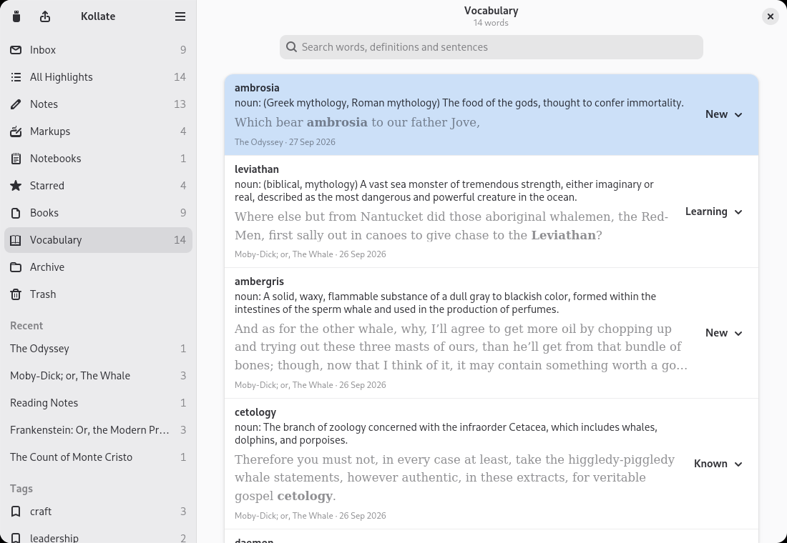 | 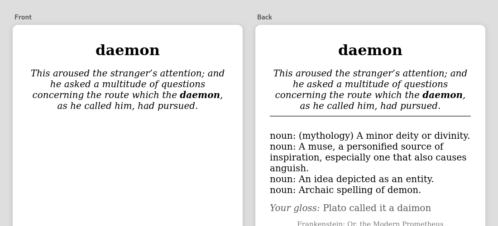 |
| *Thursday: leviathan, ambergris and cetology, each in Melville's own sentence…* | *…and "daemon" as an Anki card, gloss and all.* |

## Kobo's reader, KOReader, or both

Read in [KOReader](https://koreader.rocks/)? Kollate brings in its highlights, notes and vocabulary too, over the same USB cable, alongside the Kobo's own. Every one of KOReader's highlight colours comes through, the marks you type in a note (`*`, `?`, `#tag`) file it just the same, words keep the sentence you looked them up in, and a book you read in both is one book in your library. If you only ever use KOReader, that's fine: books get their covers from the books themselves.

## Triage like an inbox

New highlights land in an **Inbox**. Keep, archive, star or edit each with a key (`K`, `A`, `S`, `E`), trash it with `Delete`, or select several and act on them all. Every action can be undone, and your edits survive every re-import.

<p align="center">
  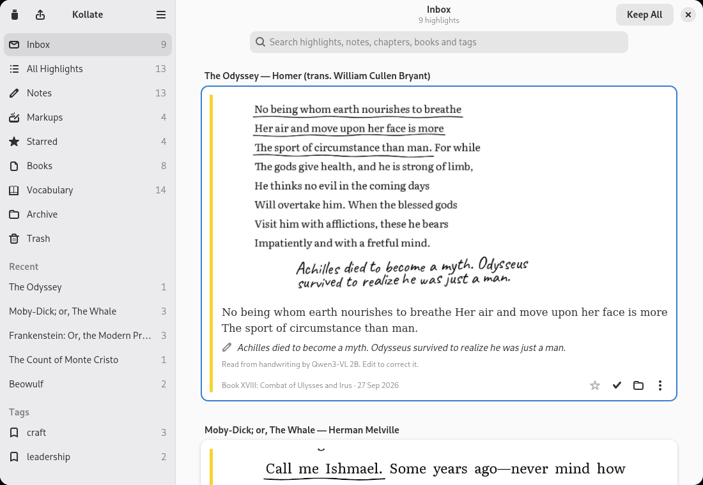
</p>
<p align="center"><i>Friday, ten minutes at the desk: the week's highlights, sorted.</i></p>

## Your library, by cover

| | |
|---|---|
| 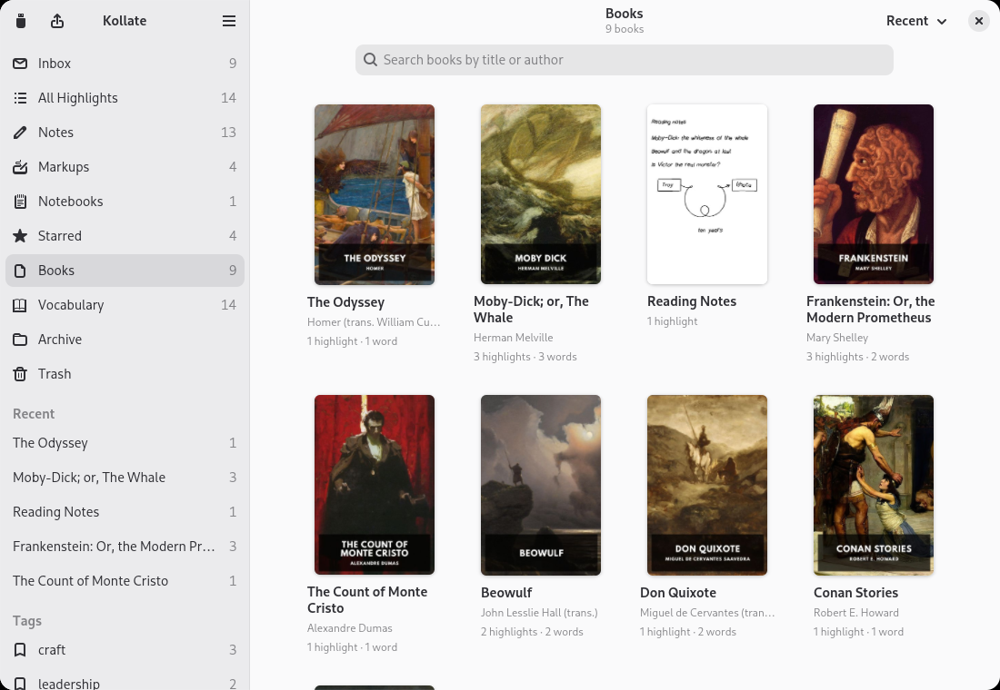 | 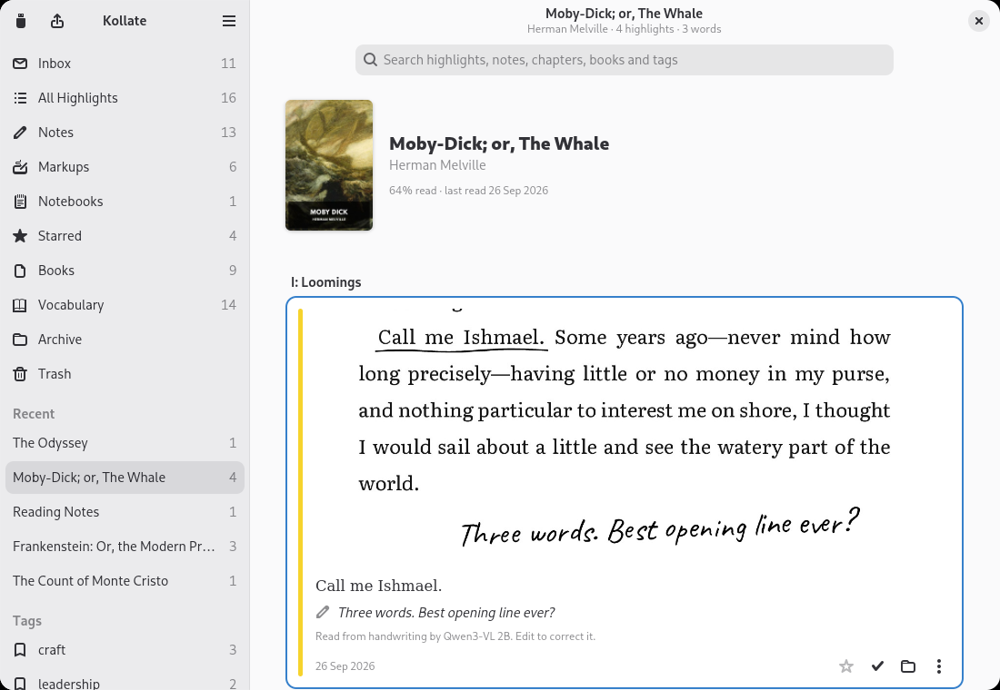 |
| *Every book you've marked, most recently read first…* | *…and each one's highlights in reading order, chapter by chapter.* |

## Take it where you work

**Obsidian:** one note per book, plus one for your vocabulary, synced into your vault, even after every import. Kollate rewrites them on each sync, so write your own thoughts at the bottom of a book's note, below the `kollate:user` line, which is never touched. **Anki:** vocabulary cards (and optionally your highlights). **Files:** a JSON backup, CSV, and Readwise CSV.

<p align="center">
  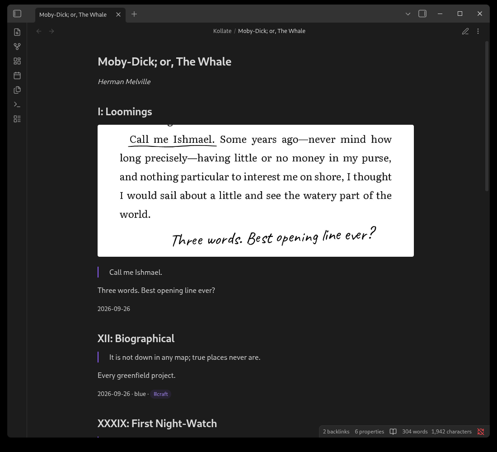
</p>
<p align="center"><i>Saturday, in Obsidian: Moby-Dick's note, with the page as you marked it.</i></p>

**Quote cards:** any highlight, note, markup or notebook page as an image, set in a reading typeface, in six palettes (one tinted with the highlight's own colour). Copy it, save it, or open a new email in Thunderbird (or your usual email app) with it attached, to send to a friend or to yourself.

<p align="center">
  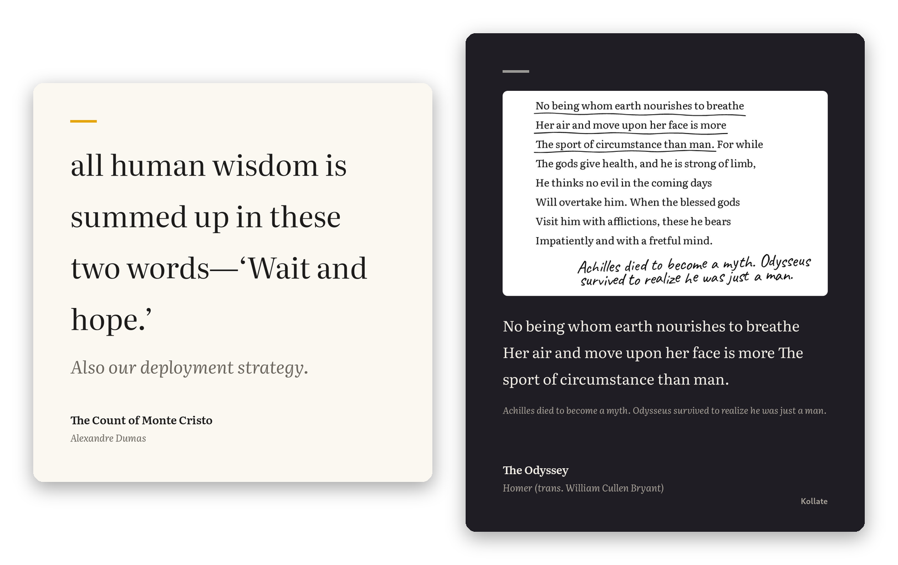
</p>
<p align="center"><i>Sunday: the week's best lines, ready to share.</i></p>

## Private, and read-only on your e-reader

- Kollate **never writes to your e-reader.** It reads a copy of the Kobo's database and KOReader's files, so you can eject at any time. The Flatpak enforces this: its sandbox can only read the device.
- **Fully offline.** The app has no network access, yet setting up handwriting takes a minute: Preferences lists the models with their download links, you click to download in your browser, then add the files with **+**. Kollate checks them and takes it from there. Definitions come from a bundled copy of the English [Wiktionary](https://www.wiktionary.org/) (over 800,000 words, compiled by [reader.dict](https://www.reader-dict.com/)); for 16 more languages, Preferences suggests the ones your books are in, with download links, just like the handwriting models.
- **No duplicates, ever.** Highlights are matched by the reader's own IDs, and by their content if those change (a factory reset, a second Kobo, calibre re-sending a book). Importing again changes nothing.
- **Your library is the source of truth.** A highlight deleted on the device stays in Kollate, flagged; your edits, stars and tags survive every import, and if the Kobo later changes something you edited, your version stays and the Kobo's is kept for review.
- **Verifiable builds.** Every release is built by GitHub Actions from its tagged source, with signed build provenance (see below).

## Install

Download from the [latest release](https://github.com/andrew-lawlor/kollate/releases/latest).

### Flatpak (any distribution)

```sh
flatpak install --user kollate.flatpak
flatpak run io.github.andrew_lawlor.Kollate
```

The bundle uses the GNOME 51 runtime from Flathub, and Flatpak installs it automatically. The sandbox only gets **read-only** access to `/media` and `/run/media`, where the Kobo is mounted, plus access to gvfs so it can notice the Kobo and eject it. It gets no network access. The Flatpak keeps its library in `~/.var/app/io.github.andrew_lawlor.Kollate/data/kollate/`.

### Debian / Ubuntu (.deb)

```sh
sudo apt install ./kollate_0.6.0-1_amd64.deb
```

The package includes the app, the `kollate-cli` tool and the English Wiktionary dictionary. It needs GTK ≥ 4.12 and libadwaita ≥ 1.5, which Debian 13 and Ubuntu 24.04 or newer provide.

### Verifying a download

Releases are built by [GitHub Actions](.github/workflows/release.yml) from the tagged commit, with signed build provenance. To check that a file came from this repository's build:

```sh
gh attestation verify kollate.flatpak --repo andrew-lawlor/kollate
```

### Building the packages

```sh
./scripts/build-deb.sh       # target/debian/kollate_<version>_amd64.deb
./scripts/build-flatpak.sh   # installs for your user; bundle in target/flatpak/kollate.flatpak
```

These are the same scripts the release workflow runs. `build-flatpak.sh` needs `org.gnome.Sdk//51`, `org.freedesktop.Sdk.Extension.rust-stable//26.08` and `org.flatpak.Builder` from Flathub. After changing `Cargo.lock`, regenerate `flatpak/cargo-sources.json` with [flatpak-cargo-generator](https://github.com/flatpak/flatpak-builder-tools/tree/master/cargo).

### From source

```sh
# Debian/Ubuntu build dependencies (plus Rust from https://rustup.rs)
sudo apt install build-essential pkg-config libgtk-4-dev libadwaita-1-dev \
    cmake libclang-dev glslc spirv-headers libvulkan-dev   # for llama.cpp (handwriting)

./scripts/fetch-dictionary.sh   # one-time: download (44 MB) and build the dictionary (~180 MB)
cargo run --release -p kollate
```

## Getting started

1. Start Kollate and connect your Kobo with a USB cable. Choose *Connect* on the Kobo if it asks.
2. Kollate spots the Kobo and imports it (or asks first, if you prefer; see *Preferences*).
3. Work through the **Inbox**, browse by book or tag, and visit **Vocabulary**.
4. Open **Export** (`Ctrl+E`) to sync to Obsidian or make an Anki deck.
5. Press **Eject** in the banner when you're done.

The **[user guide](docs/guide.md)** covers everything in detail, with screenshots: triage, handwriting, marks, notebooks, vocabulary, exports, shortcuts and troubleshooting.

### Reading your handwriting

In *Preferences → Handwriting*, pick a model: **Qwen3-VL 2B** (2.7 GB, recommended), 4B (3.3 GB, a little more accurate on hurried writing) or 8B (6.2 GB, most accurate). Download its two files with the links there, then add them with **+**. Kollate checks them and, after each import, reads your markups and notebook pages in the background: about half a second a note with a graphics card, or 2–4 seconds without. Marked text always comes from the book itself. It needs an x86-64 processor from about 2013 or later (with AVX2).

From a terminal: `kollate-cli models` lists them with download links, `kollate-cli models add FILES…` adds them, and `kollate-cli transcribe` reads what's waiting.

Your library lives in `~/.local/share/kollate/` (`~/.var/app/io.github.andrew_lawlor.Kollate/data/kollate/` for the Flatpak).

### Command line

`kollate-cli` does the same work from a terminal:

```sh
kollate-cli inspect /media/$USER/KOBOeReader          # show what's on the Kobo (read-only)
kollate-cli import  /media/$USER/KOBOeReader --dry-run
kollate-cli import  /media/$USER/KOBOeReader
kollate-cli library                                    # what's in your library
kollate-cli contexts /media/$USER/KOBOeReader          # context sentences for vocab words
kollate-cli export obsidian ~/Vault/Books
kollate-cli export anki Kollate.apkg --highlights
kollate-cli dict build-stardict ~/dicts/foo.ifo foo.db # convert a dictionary
```

## Compatibility

Tested on a **Kobo Libra Colour** (firmware 4.45, database version 176), a **Kobo Clara Colour** (firmware 4.42, database version 176) and a **Kobo Clara 2E** (firmware 4.38, database version 174), so on colour and black-and-white Kobos alike, with sideloaded and Kobo Store books. Other models use the same database layout and should work. If your Kobo's database version is new to Kollate, it still imports and shows a one-time notice with a **Report** button. Please [send a compatibility report](https://github.com/andrew-lawlor/kollate/issues/new?template=compatibility.yml), even if everything works. Context sentences need sideloaded, DRM-free books. Kobo Store books with DRM still import, just without context sentences.

**KOReader** is read from its folder on the Kobo (`.adds/koreader`), tested with KOReader 2026.07 on the Libra Colour. Book settings are found wherever KOReader keeps them: next to the books (in any folder), in `docsettings` or in `hashdocsettings`. Handwriting from KOReader's third-party Pencil plugin isn't read yet. KOReader on other devices (Kindle, PocketBook) isn't detected yet.

## Development

```
crates/
  kollate-core/   Kobo and KOReader readers, library (SQLite), import/dedup, dictionaries, EPUB context, exports
  kollate-cli/    command-line tool
  kollate/        GTK 4 / libadwaita app
tests/fixtures/   a trimmed Kobo database used by the tests
SPEC.md           design notes, data model and what was verified on a real device
```

```sh
cargo test          # unit and integration tests, including against a real Kobo database
cargo clippy --all-targets
```

## License

Kollate is free software under the **GNU General Public License v3.0 or later**; see [LICENSE](LICENSE).

Definitions come from **[Wiktionary](https://www.wiktionary.org/)** © Wiktionary contributors, compiled by [reader.dict](https://www.reader-dict.com/), under [CC BY-SA 4.0](https://creativecommons.org/licenses/by-sa/4.0/). The bundled dictionary is distributed under the same licence; see [THIRD-PARTY.md](crates/kollate/data/THIRD-PARTY.md). Kollate isn't affiliated with reader.dict or the Wikimedia Foundation.

The books in the screenshots are **[Standard Ebooks](https://standardebooks.org)** editions, dedicated to the public domain ([CC0](https://creativecommons.org/publicdomain/zero/1.0/)). Thanks to its volunteers for their work.

Kollate isn't affiliated with or endorsed by Rakuten Kobo or the KOReader project. "Kobo" is a trademark of Rakuten Kobo Inc.
