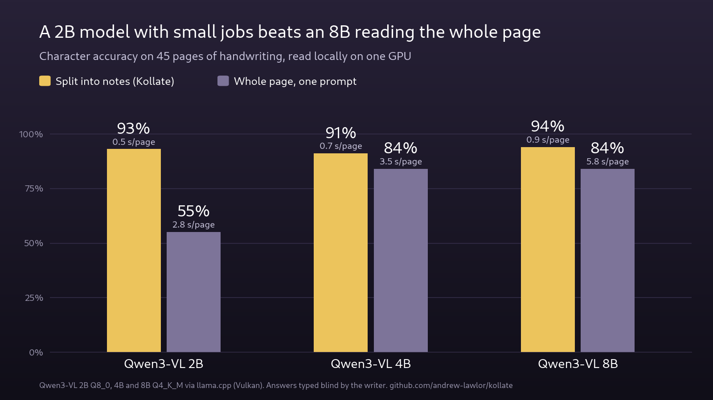

<p align="center">
  
</p>

<p align="center">
  <b>Everything you mark on your e-reader, read, sorted and put to work.</b><br>
  Highlights and notes from your Kobo, in its own reader (Nickel) or in KOReader. Kollate turns your margin notes<br>
  and notebooks into text, files what you star and tag with the pen, and makes flashcards from the words you look up.<br>
  <sub>A native Linux app for GNOME and any desktop. Offline, private, and it never writes to your e-reader.</sub>
</p>

<p align="center">
  <a href="https://github.com/andrew-lawlor/kollate/releases/latest"><b>Download</b></a> ·
  <a href="docs/guide.md"><b>User guide</b></a> ·
  <a href="SPEC.md">Design notes</a>
</p>

<p align="center"><i>"It is a comforting thing to have an archive: a place where the scattered leaves of memory are bound together."</i></p>

E-readers hoard what you write in them. Kollate pulls it all onto your computer, into one library you can search, and sends none of it anywhere.

What follows is an example week of reading with it in your workflow.

## Your handwriting, read as text

Kollate reads the scrawl in your margins. Notes turn into searchable text, and whatever you underlined or circled comes back as the book's own words. A small vision model does the reading on your machine. When it stumbles, you correct it.

<p align="center">
  
</p>
<p align="center">
  <i>Monday, Book XVIII of the Odyssey: a passage underlined, a thought in the margin. Kollate reads both.</i>
</p>

## Curate with the pen

Filing highlights is usually a chore for later. Do it in the margin instead, with marks readers have used for centuries.

| In the margin | In Kollate |
|---|---|
| `*` (or a drawn star), or `NB` | Starred |
| `?` | Tagged `question` |
| `#leadership` | Tagged `leadership` |
| A circled word | In Vocabulary, with its sentence and a definition |
| A circled word, with a note beside it | …and the note is your **gloss** |

| | |
|---|---|
|  |  |
| *Tuesday: a `?` beside Melville's white whale files the passage under `question`…* | *…and "daemon", circled in Frankenstein, arrives in Vocabulary with the gloss written beside it.* |

Without a stylus, type the mark into a highlight's note. Any Kobo, same result.

The asterisk began as the *asteriskos*, a little star Alexandria's librarians pinned beside lines of Homer. Medieval readers wrote *nota bene* and *quaere*. A gloss was a hard word's meaning, jotted beside it, and enough of them made a glossary. The [guide](docs/guide.md#mark-it-in-the-margin) has the rest.

## Notebooks, Basic and Advanced

The Kobo converts handwriting only in Advanced notebooks, and only on request. Kollate transcribes every page of both kinds and redraws the ink above the text.

<p align="center">
  
</p>
<p align="center"><i>Wednesday: reading notes, and a map of Odysseus's long way home.</i></p>

## Every word, in the sentence you met it

The Kobo remembers the words you look up and forgets where you found them. Kollate goes back to the book for the sentence, pulls a definition from an offline dictionary, and tracks each word from *New* to *Known*. Anki cards follow, and they update without wiping your progress.

| | |
|---|---|
|  |  |
| *Thursday: leviathan, ambergris and cetology, each in Melville's own sentence…* | *…and "daemon" as an Anki card, gloss and all.* |

## KOReader too

[KOReader](https://koreader.rocks/) highlights, notes and looked-up words come in over the same cable, colours intact. A book read in both readers stays one book.

With [our Pencil plugin](https://github.com/andrew-lawlor/pencil.koplugin), KOReader handwriting comes in too. The plugin notes where each word sits on the page, so an underline yields exactly the words above it.

How the two compare so far, with the recommended 2B model:

| | Kobo's reader | KOReader, with Pencil |
|---|---|---|
| Handwritten notes, characters right | 93% | 98.6% |
| Underlined and circled passages found | 38 of 39 | 13 of 13 |
| Marked text | read from a picture, matched to the book | the words on the page, exactly |
| Measured on | 57 pages, two writers, Libra Colour | 26 markups, one writer, Elipsa 2E |

Both samples are small, and they don't match: different pages, devices and writing. Read the first row as a hint. A proper benchmark is underway.

## Triage like an inbox

New highlights pile up in the **Inbox**. One key keeps, archives, stars or edits each (`K`, `A`, `S`, `E`), and `Delete` bins it. Anything can be undone.

<p align="center">
  
</p>
<p align="center"><i>Friday, ten minutes at the desk: the week's highlights, sorted.</i></p>

## Your library, by cover

| | |
|---|---|
|  |  |
| *Every book you've marked, most recently read first…* | *…and each one's highlights in reading order, chapter by chapter.* |

## Take it where you work

**Obsidian:** a note per book and one for your words, resynced after every import. Anything you write below a note's `kollate:user` line survives. **Anki:** word cards, highlights optional. **Files:** JSON, CSV, Readwise CSV.

<p align="center">
  
</p>
<p align="center"><i>Saturday, in Obsidian: Moby-Dick's note, with the page as you marked it.</i></p>

**Quote cards** turn a highlight, note or inked page into an image in one of six palettes, to copy, save or email.

<p align="center">
  
</p>
<p align="center"><i>Sunday: the week's best lines, ready to share.</i></p>

## Private, and read-only on your e-reader

- **Read-only on the device.** Kollate copies what it needs and never writes back, so you can eject any time. The Flatpak's sandbox enforces it.
- **No network.** Models and extra dictionaries come from links in Preferences, fetched in your browser. The English [Wiktionary](https://www.wiktionary.org/) ships inside, and 16 other languages are on offer.
- **Re-importing is harmless.** A factory reset or a second Kobo won't create duplicates.
- **Your edits outrank the device's.** Stars, tags and corrections survive every import, and a highlight deleted on the Kobo lingers in Kollate, flagged.

## Install

Download from the [latest release](https://github.com/andrew-lawlor/kollate/releases/latest).

### Flatpak (any distribution)

```sh
flatpak install --user kollate.flatpak
flatpak run io.github.andrew_lawlor.Kollate
```

Flatpak fetches the GNOME 51 runtime itself. The sandbox can read the Kobo but not write to it, and has no network.

### Debian / Ubuntu (.deb)

```sh
sudo apt install ./kollate_0.7.0-1_amd64.deb
```

Ships the app, `kollate-cli` and the English Wiktionary. Needs GTK 4.12 and libadwaita 1.5 or newer, as in Debian 13 and Ubuntu 24.04.

### Verifying a download

[GitHub Actions](.github/workflows/release.yml) builds each release from its tagged commit and signs the result. To check a file:

```sh
gh attestation verify kollate.flatpak --repo andrew-lawlor/kollate
```

### Building the packages

```sh
./scripts/build-deb.sh       # target/debian/kollate_<version>_amd64.deb
./scripts/build-flatpak.sh   # installs for your user; bundle in target/flatpak/kollate.flatpak
```

The release workflow runs the same scripts. `build-flatpak.sh` needs `org.gnome.Sdk//51`, `org.freedesktop.Sdk.Extension.rust-stable//26.08` and `org.flatpak.Builder` from Flathub. After changing `Cargo.lock`, regenerate `flatpak/cargo-sources.json` with [flatpak-cargo-generator](https://github.com/flatpak/flatpak-builder-tools/tree/master/cargo).

### From source

```sh
# Debian/Ubuntu build dependencies (plus Rust from https://rustup.rs)
sudo apt install build-essential pkg-config libgtk-4-dev libadwaita-1-dev \
    cmake libclang-dev glslc spirv-headers libvulkan-dev   # for llama.cpp (handwriting)

./scripts/fetch-dictionary.sh   # one-time: download (44 MB) and build the dictionary (~180 MB)
cargo run --release -p kollate
```

## Getting started

1. Start Kollate and plug in the Kobo. Tap *Connect* if it asks.
2. The import runs by itself.
3. Clear the **Inbox**, browse by book or tag, check **Vocabulary**.
4. **Export** (`Ctrl+E`) to Obsidian or Anki.
5. **Eject**.

The **[user guide](docs/guide.md)** covers the rest.

### Reading your handwriting

Pick a model in *Preferences → Handwriting*: **Qwen3-VL 2B** (2.7 GB, recommended), 4B (3.3 GB) or 8B (6.2 GB, most accurate). Fetch its two files from the links there, then add them with **+**. After each import Kollate transcribes new ink in the background, about half a second a note on a graphics card and 2 to 4 seconds without one. It needs an x86-64 CPU with AVX2, roughly 2013 onward.

<p align="center">
  
</p>
<p align="center"><i>Why the 2B: handed small jobs, it nearly matches the 8B in a fraction of the time.</i></p>

From a terminal: `kollate-cli models` lists the models, `kollate-cli models add FILES…` adds them, and `kollate-cli transcribe` reads what's waiting.

Your library lives in `~/.local/share/kollate/`, or `~/.var/app/io.github.andrew_lawlor.Kollate/data/kollate/` for the Flatpak.

### Command line

```sh
kollate-cli inspect /media/$USER/KOBOeReader          # what's on the Kobo (read-only)
kollate-cli import  /media/$USER/KOBOeReader --dry-run
kollate-cli import  /media/$USER/KOBOeReader
kollate-cli library                                    # what's in your library
kollate-cli contexts /media/$USER/KOBOeReader          # context sentences for vocab words
kollate-cli export obsidian ~/Vault/Books
kollate-cli export anki Kollate.apkg --highlights
kollate-cli dict build-stardict ~/dicts/foo.ifo foo.db # convert a dictionary
```

## Compatibility

| Kobo | Firmware | Database | Stylus |
|---|---|---|---|
| Libra Colour | 4.45 | 176 | markups and notebooks tested |
| Elipsa 2E | 4.38 | 174 | markups and notebooks tested |
| Clara Colour | 4.42 | 176 | none |
| Clara 2E | 4.38 | 174 | none |

Sideloaded and store books both import; context sentences need DRM-free files. Other Kobos should work. Kollate flags a database version it hasn't seen, and a [report](https://github.com/andrew-lawlor/kollate/issues/new?template=compatibility.yml) helps even when nothing broke.

**KOReader** 2026.07 or newer. Handwriting needs our Pencil plugin; the original's ink isn't read. KOReader on Kindle or PocketBook isn't detected yet.

## Development

```
crates/
  kollate-core/   Kobo and KOReader readers, library (SQLite), import/dedup, dictionaries, EPUB context, exports
  kollate-cli/    command-line tool
  kollate/        GTK 4 / libadwaita app
tests/fixtures/   a trimmed Kobo database used by the tests
SPEC.md           design notes, data model and what was verified on a real device
```

```sh
cargo test          # unit and integration tests, including against a real Kobo database
cargo clippy --all-targets
```

## License

Kollate is free software under the **GNU General Public License v3.0 or later**; see [LICENSE](LICENSE).

Definitions come from **[Wiktionary](https://www.wiktionary.org/)** © Wiktionary contributors, compiled by [reader.dict](https://www.reader-dict.com/), under [CC BY-SA 4.0](https://creativecommons.org/licenses/by-sa/4.0/). The bundled dictionary is distributed under the same licence; see [THIRD-PARTY.md](crates/kollate/data/THIRD-PARTY.md). Kollate isn't affiliated with reader.dict or the Wikimedia Foundation.

The books in the screenshots are **[Standard Ebooks](https://standardebooks.org)** editions, dedicated to the public domain ([CC0](https://creativecommons.org/publicdomain/zero/1.0/)). Thanks to its volunteers.

Kollate isn't affiliated with or endorsed by Rakuten Kobo or the KOReader project. "Kobo" is a trademark of Rakuten Kobo Inc.
