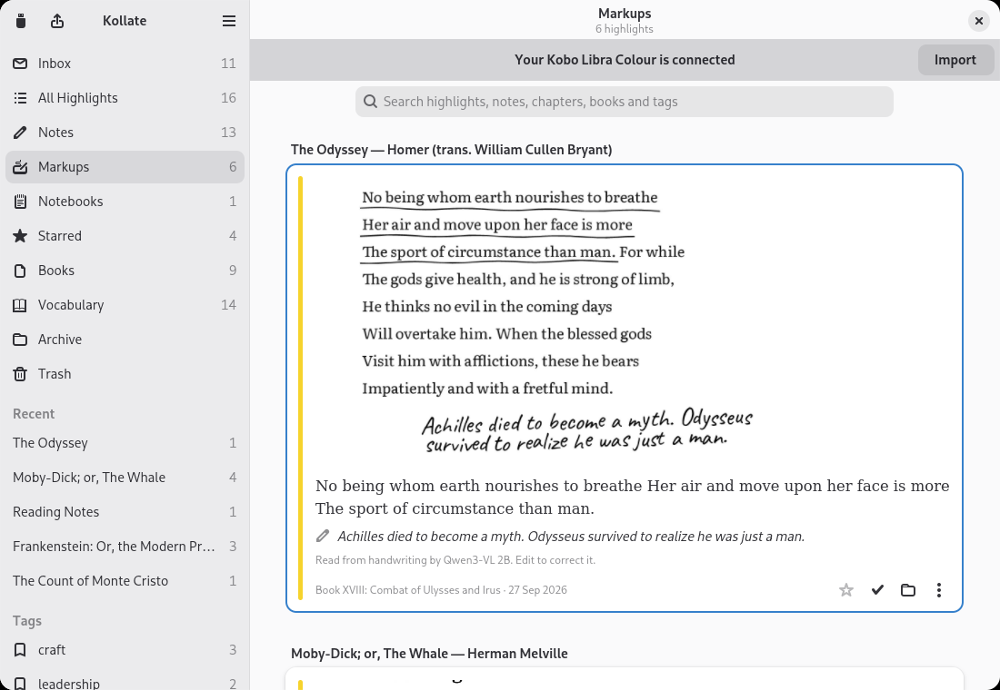
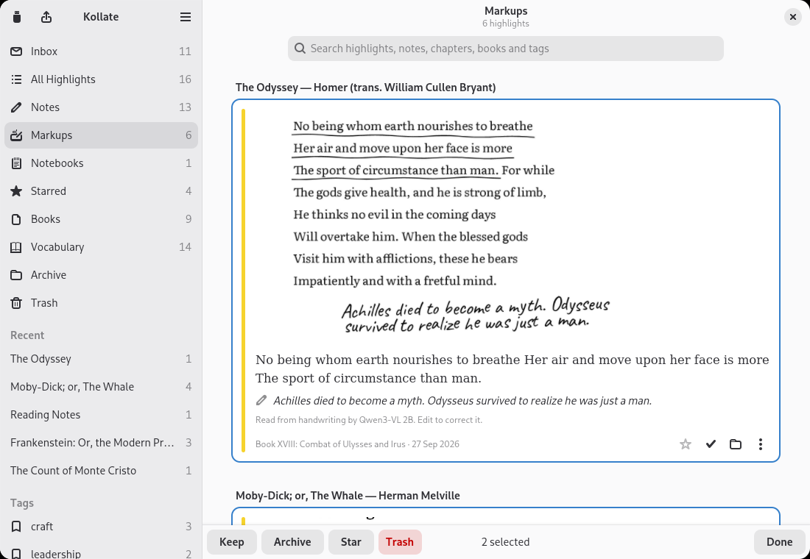
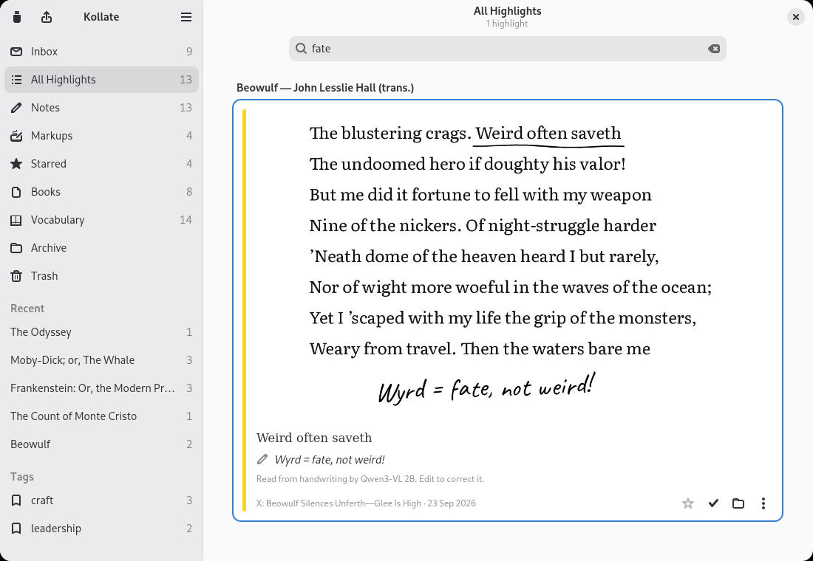
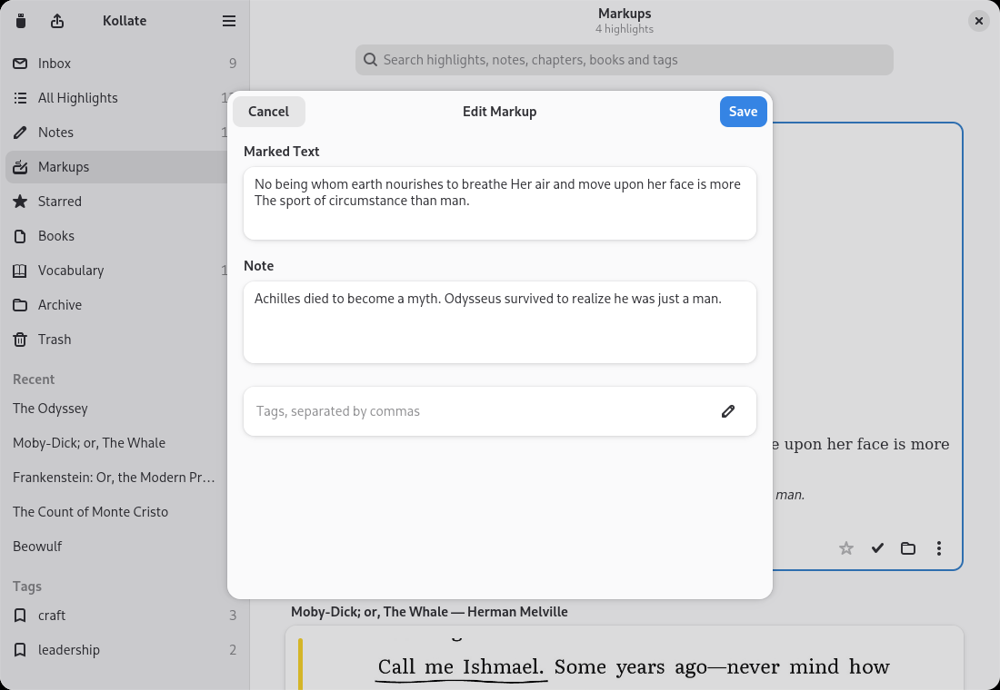
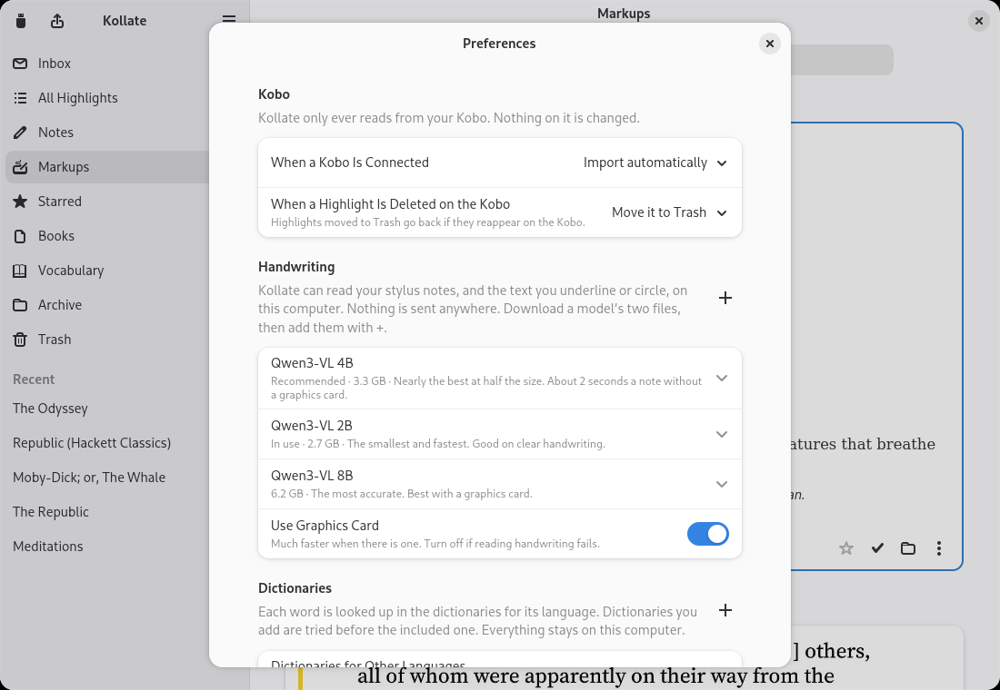
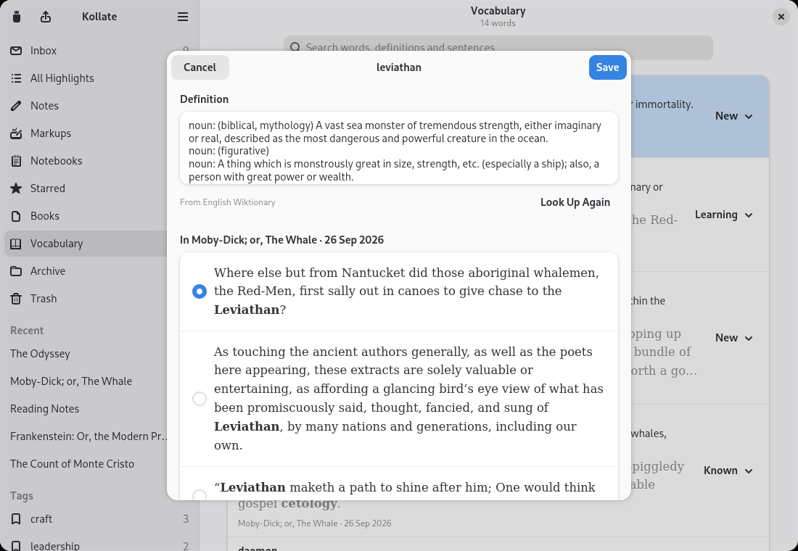
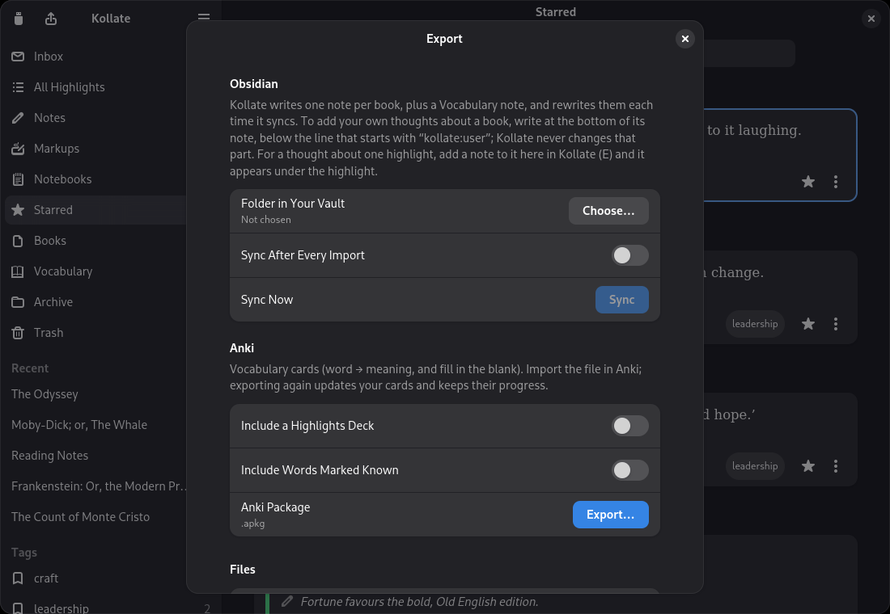
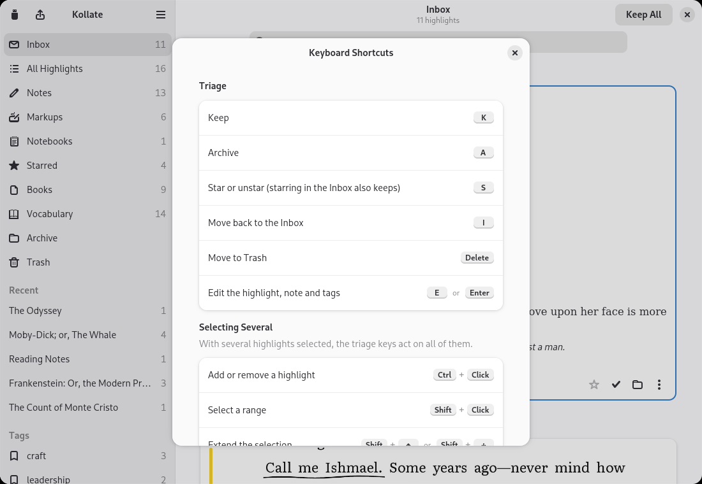

# Kollate user guide

For Kollate 0.7.1. Kollate brings everything you mark on a Kobo e-reader, in its own reader or in KOReader — highlights, notes, stylus markups, notebooks and Vocabulary Builder words — into a library on your computer, where you can triage it, correct it, read your handwriting as text, and export it to Obsidian, Anki and more. It never writes to your Kobo and never goes online.

**Contents**

1. [Install](#1-install)
2. [Connect your Kobo and import](#2-connect-your-kobo-and-import)
3. [Triage the Inbox](#3-triage-the-inbox)
4. [Find your way around](#4-find-your-way-around)
5. [Edit highlights, notes and tags](#5-edit-highlights-notes-and-tags)
6. [Read your handwriting](#6-read-your-handwriting)
7. [Vocabulary](#7-vocabulary)
8. [Export](#8-export)
9. [Preferences](#9-preferences)
10. [Keyboard shortcuts](#10-keyboard-shortcuts)
11. [The command line](#11-the-command-line)
12. [Your data](#12-your-data)
13. [Troubleshooting](#13-troubleshooting)

---

## 1. Install

Download a package from the [latest release](https://github.com/andrew-lawlor/kollate/releases/latest).

**Flatpak** (any distribution):

```sh
flatpak install --user kollate.flatpak
```

Flatpak installs the GNOME runtime from Flathub if you don't have it. The Flatpak can only *read* `/media` and `/run/media`, where a Kobo is mounted, and has no network access.

**Debian 13 or Ubuntu 24.04 and newer** (`.deb`):

```sh
sudo apt install ./kollate_0.7.1-1_amd64.deb
```

This also installs `kollate-cli`, the [command-line tool](#11-the-command-line).

**Checking a download.** Every release file is built by GitHub Actions from the tagged source. To confirm a file came from that build, not somewhere else: `gh attestation verify kollate.flatpak --repo andrew-lawlor/kollate`. The release also lists `SHA256SUMS`.

## 2. Connect your Kobo and import

Start Kollate and connect your Kobo with its USB cable. When the Kobo asks, choose **Connect**. Kollate notices it and a banner appears:



By default Kollate imports straight away. You can change this under **Preferences → When a Kobo Is Connected**:

- **Import automatically** (the default).
- **Ask first**: the banner offers an **Import** button.
- **Do nothing**: import when you want with **Import from Kobo** (the Kobo button in the top left, or **Ctrl+I**).

When you're done, press **Eject** in the banner, then unplug. You can also eject at any time during use: Kollate reads a copy of the Kobo's database, never the original, and holds nothing open on the device.

**Looking for something to read?** [Standard Ebooks](https://standardebooks.org) makes free, carefully produced editions of public-domain classics, with a Kobo edition (kepub) of each. Every book in this guide's screenshots is one of theirs.

### What gets imported

| From your Kobo | In Kollate |
|---|---|
| Highlights, in all four colours | Highlights, sorted into chapters in reading order |
| Notes you typed on a highlight | The highlight's note |
| Stylus markups (stylus models; tested on the Libra Colour and Elipsa 2E) | The page with your ink on it, and optionally [your handwriting as text](#6-read-your-handwriting) |
| Notebooks, Basic and Advanced (stylus models) | A book per notebook, each page redrawn from your ink, and optionally [its writing as text](#notebooks) |
| Vocabulary Builder words | [Vocabulary](#7-vocabulary), with the sentence you looked each word up in and a definition |
| Book covers, titles, authors, progress | The [Books](#books) page |

Page bookmarks (dog-ears) aren't imported. For books bought from the Kobo Store, which are locked with DRM, Kollate can't read the book text: their highlights import normally, but vocabulary words get no context sentence and markups get no exact marked text.

To import from a backup of a Kobo rather than the device, use **Main Menu → Import from Folder…** and choose the folder that contains `.kobo`.

### KOReader

If KOReader is installed on your Kobo, Kollate imports from it in the same go, with nothing to set up:

| From KOReader | In Kollate |
|---|---|
| Highlights, in all nine colours | Highlights, in their colours, by chapter |
| Notes on a highlight | The highlight's note, with a `*`, `NB` or `?` on a line of its own, or a `#tag` anywhere, [filed as a mark](#mark-it-in-the-margin) |
| Vocabulary builder words | [Vocabulary](#7-vocabulary), with the sentence KOReader kept |
| Books | The same book as in the Kobo's reader, if you read it in both; a book only KOReader has seen gets its cover from the book file |

Once your library has anything from KOReader, every card says which reader it came from, **Kobo** or **KOReader**. Bookmarks aren't imported. Handwriting is, from [our fork of the Pencil plugin](https://github.com/andrew-lawlor/pencil.koplugin): each page you write on comes in as a markup, read like the Kobo's, except that what you underline or circle is taken from the words on the page, so it's always the book's exact text. Handwriting from the original Pencil plugin isn't read. A highlight deleted in KOReader is treated like one deleted on the Kobo (below).

### Importing again

Import as often as you like. Kollate recognises everything it has seen before, even after a Kobo factory reset or when a book is re-sent from calibre, so **nothing is ever duplicated**. Only what's new or changed comes in, and a notice tells you what happened ("3 new highlights · 2 new words").

- **Edited on the Kobo:** if you change a highlight's note on the Kobo, Kollate updates it — unless you've edited it in Kollate too. Then your version stays and the card shows **changed on Kobo**; the card's menu has **Use Kobo's Version**.
- **Deleted on the Kobo:** Kollate keeps it. The card shows **deleted on Kobo**, and a **Deleted on Kobo** view appears in the sidebar. If you'd rather they go to Kollate's Trash, change **Preferences → When a Highlight Is Deleted on the Kobo**; they come back out of Trash if they reappear on the Kobo.
- **A new kind of Kobo:** Kollate is tested on a Kobo Libra Colour, Clara Colour, Clara 2E and Elipsa 2E. If your Kobo's database is a version Kollate hasn't been tested with, it imports anyway and shows a notice once, with a **Report** button that opens a pre-filled compatibility report. Reports, even "it all worked", are very welcome.

## 3. Triage the Inbox

Everything new lands in the **Inbox**, grouped by book.


Select a highlight (click it, or move with **↑** and **↓**) and decide:

| Key | Does |
|---|---|
| **K** | Keep: out of the Inbox, into All Highlights |
| **A** | Archive: kept, but out of the way |
| **S** | Star (and, in the Inbox, keep) |
| **Delete** | Move to Trash |
| **E** or **Enter** | [Edit](#5-edit-highlights-notes-and-tags) |
| **I** | Move back to the Inbox |

The same actions are on each card: the star, the check mark (keep), the folder (archive) and the **⋮** menu. **Keep All** at the top keeps everything in the Inbox at once.

### Several at once

Select several highlights and the keys act on all of them. **Ctrl+click** adds or removes one, **Shift+click** selects a range, **Shift+↑/↓** extends the selection, and **Ctrl+A** selects everything listed. A bar at the bottom offers the same actions; **Escape** or **Done** goes back to one.



Keeping, archiving, starring and trashing can all be undone from the notice that follows.

## 4. Find your way around


The sidebar has these views:

| View | Shows |
|---|---|
| **Inbox** | New, not yet triaged |
| **All Highlights** | Everything except Archive and Trash |
| **Notes** | Highlights with a note, including handwritten notes Kollate has read |
| **Markups** | Your stylus markups |
| **Notebooks** | Pages of your Kobo notebooks (appears once you have some) |
| **Starred** | Starred highlights |
| **Books** | Your library by cover |
| **Vocabulary** | Words from Vocabulary Builder |
| **Archive**, **Trash** | Archived and trashed highlights |
| **Deleted on Kobo** | Appears when something you have was deleted on the Kobo |

Below them, **Recent** lists the five books you read most recently, and **Tags** lists your tags once you use any.

### Books

The **Books** page shows every book with highlights or looked-up words, sorted by **Recent** (last read), **Title** or **Author**. Open one to see its cover, reading progress and highlights by chapter, in the order they appear in the book. **Alt+←** returns to Books.


### Search

The search field at the top of every page (**Ctrl+F**) filters what's shown as you type. In highlight views it searches the text, notes (including handwriting Kollate has read), chapters, book titles, authors and tags; on the Books page, titles and authors; in Vocabulary, words, definitions and sentences. **Escape** clears it.



### Copying

A card's **⋮** menu has **Copy Text**, and **Copy as Markdown**: the highlight as a quote, credited to the author, book and chapter, followed by your note. Markups also have **Open Page Image**, to see the whole page in your image viewer.

### Share as an image

**Share as Image…** in a card's **⋮** menu turns a highlight, note, markup or notebook page into a quote card: the words in a reading typeface, your note under them if you like, and the book at the foot. Choose **Square** or **Tall** (the shape social feeds prefer), a **Palette**, and for a markup whether to **Show the Page** with your ink on it. The palettes: **Paper** (a book page), **Night** (dark), **Sepia**, **Highlight** (a soft tint of the highlight's own Kobo colour, so a pink highlight makes a pink card), **Ink** (black and white) and **E-ink** (the grey of your Kobo's screen). Then:

- **Copy** puts the image on the clipboard, to paste anywhere.
- **Email…** opens a new email in your email app (Thunderbird, Evolution…) with the card attached and the quote in the message, for sending to a friend, or to yourself to have it on your phone. Put your own address in **Preferences → Sharing → Email Cards To**, and every card's email is addressed to you. Kollate sends nothing: it's your email app that sends it, if you press Send. The app used is the one set in your system settings (in GNOME, **Settings → Apps → Default Apps → Mail**).
- **Save…** saves it as a PNG.

Kollate remembers your choices for next time.

### Dark mode

Kollate follows your desktop's light or dark style.

## 5. Edit highlights, notes and tags

Press **E** (or **Enter**, or **Edit…** in the card's menu) to correct a typo in a highlight, rewrite a note, or add tags (separated by commas).

Kollate never loses the original. Once you've edited something, the dialog shows **On Your Kobo** with the original and a **Restore Kobo Version** button, and the card shows **edited**. Your edits survive every future import.

For a markup, the dialog edits the **Marked Text** and the **Note** that Kollate [read from your handwriting](#6-read-your-handwriting); once edited, it shows **Read From Handwriting** with the model's reading and a **Restore Transcription** button:



## 6. Read your handwriting

On a Kobo with a stylus, the notes you write in the margin, and what you underline or circle, are saved as pictures. Kollate can turn them into text — on your computer, with a small AI model you download once. Nothing is sent anywhere, and Kollate itself never downloads anything: the app has no network access.

### What it does

For each markup, Kollate:

1. **Separates your notes from your marks** using the shape and order of your pen strokes. Writing turned sideways in a margin is turned upright the way you wrote it.
2. **Takes the words you underlined or circled from the book itself**, so they're exact, down to the book's punctuation. This needs a sideloaded, DRM-free book, and your Kobo connected when the markup was imported.
3. **Reads your handwriting** with the model, one note at a time.
4. **Corrects misread names** against the book: a note that comes back as "Who is Pokmarchus?" beside a page about Polemarchus becomes "Who is Polemarchus?". Only words no dictionary knows are corrected, so real words are never changed.

The marked text becomes the markup's text and your handwriting its note, so both are searchable, appear in the **Notes** view, and are exported like any other highlight. Until you edit them, the card says **Read from handwriting by …**, so you know it's the model's reading.

### Notebooks

Pages of your Kobo notebooks are read the same way, whole: Kollate finds the lines of writing on the page, reads them one by one, and leaves drawings out (shapes, arrows, doodles; a short label beside them is still read). This works for **Basic** notebooks too, which the Kobo can't turn into text, and needs no **Convert** on the Kobo for Advanced ones.


Each notebook appears as a book, with the Kobo's picture of it as its cover, and its pages in the **Notebooks** view. A page's text is its highlight text: search it, edit it with **E**, star, tag and export it like anything else. Pages you add or write more on are read again at the next import; your corrections stay. If a notebook comes from a newer Kobo that stores notebooks differently, Kollate leaves it out and keeps what it already has.

### Set it up

1. Open **Preferences → Handwriting**. Pick a model: expand its row and use its two download links, one for the model and one for its vision file. They download in your browser.

   | Model | Download | Good for |
   |---|---|---|
   | **Qwen3-VL 2B** (recommended) | 2.7 GB | Small and fast; reads clear handwriting very well |
   | Qwen3-VL 4B | 3.3 GB | A little more accurate on hurried handwriting |
   | Qwen3-VL 8B | 6.2 GB | The most accurate; best with a graphics card |

2. When both files have **finished** downloading, press **+** in the Handwriting group and select both. (Browsers create the file before it's complete; if you pick it too early, Kollate says it hasn't finished downloading.)
3. Kollate checks the files against their known checksums, copies them into your library, and starts reading your markups in the background. It also reads new markups after every import.



### Speed and requirements

With a graphics card, a note takes well under a second; on the processor alone, about 1–4 seconds depending on the model. **Use Graphics Card** in Preferences switches between them; turn it off if reading fails. Reading handwriting needs a 64-bit processor from about 2013 or later (with AVX2); on older computers, Preferences explains that it isn't available, and everything else works as usual.

### When it gets something wrong

Clear handwriting is usually read exactly. Hurried scrawls, and very short or unusual words, can defeat any model. Press **E** and fix it: your correction wins from then on, and **Restore Transcription** in the same dialog brings back the model's reading.

If you install more than one model, Preferences lets you choose which to use. Choosing another reads your markups again with it; your corrections are kept.

### Mark it in the margin

You can triage while you read, with the pen: write a mark beside a passage you've underlined or circled, and Kollate acts on it when it reads the page.

| Write | Kollate |
|---|---|
| `*` or a drawn star | Stars it (and keeps it, as starring in the Inbox does) |
| `NB` | Stars it |
| `?` | Tags it `question`: a list of passages to look into |
| `#word` | Tags it, e.g. `#leadership` |


`*`, `NB` and `?` count on their own: a note like "why?" stays a note. `#word` counts anywhere in a note, and is taken out of it; a tag one letter off one you have (`#leadershp`) joins it. Each mark takes effect once: if you unstar or untag something in Kollate, it stays that way when the page is read again.

Two things to know. The Kobo keeps everything you mark on a page in one visit as one markup, so a mark applies to all of it. And a star drawn next to an ordinary highlight doesn't attach to it; there, type the mark as the highlight's note instead. Typed notes work on any Kobo, with or without a stylus: type `#leadership`, `NB` or `?` as a highlight's note.

### Circle a word to learn it

Circle a single word on the page and it goes to [Vocabulary](#7-vocabulary), with the book's sentence around it and a definition, like a word you looked up. Write a few words beside it and they become **your gloss** on the word, shown with its definition and on its Anki card. To stop circled words being added, turn off **Circled Words Go to Vocabulary** in Preferences → Handwriting.


> **Old habits.** None of this is new. Around 150 BC, Aristarchus, head of the Library at Alexandria, edited Homer with signs in the margin, among them the *asteriskos*, "little star", where our asterisk comes from. Medieval readers wrote *nota bene* beside what mattered, and *quaere*, "inquire", beside what they doubted. A hard word got a *gloss*, its meaning written above it or in the margin; collected, glosses became the first glossaries. Readers from Erasmus to Locke kept commonplace books, copying passages under headings, as tags do. And scriptoria *collated* their copies against the original, which is where Kollate's name comes from.

## 7. Vocabulary

Every word you looked up in the Kobo's dictionary appears in **Vocabulary**, with:

- **The sentence you met it in**, found inside the book (sideloaded, DRM-free books; the Kobo doesn't record this itself).
- **A definition** from Kollate's offline English Wiktionary.

Words you [circled on the page](#circle-a-word-to-learn-it) appear here too, marked **Circled in** their book in the word's dialog, with your gloss if you wrote one.


Mark each word **New**, **Learning**, **Known** or **Ignored**. Open a word to pick a different context sentence, edit its definition, or **Look Up Again**:



Words that share a dictionary form ("leviathans", "leviathan") are merged into one.

### Other languages

Kollate includes the English Wiktionary. Free Wiktionary dictionaries for 16 more languages, compiled by reader.dict, are a click away, the same way as handwriting models: **Preferences → Get a Dictionary** suggests the languages your books are in (a Spanish novel brings up Spanish), with every other language under **More Languages**. Press **Download**, and when it's done, add the file with **+** under Dictionaries (the file chooser opens in your Downloads folder). Words already in Vocabulary in that language are defined straight away. StarDict (`.ifo`) and kaikki.org (`.jsonl`) dictionaries can be added with **+** too. reader.dict is made by volunteers; the same group has links to their website and to **Donate**, if their dictionaries help you. Each word is looked up in the dictionaries for its language; dictionaries you add are tried before the included one.

## 8. Export

Open **Export** with **Ctrl+E** or the button in the top left.



### Obsidian

Choose a folder in your vault and press **Sync**. Kollate writes one note per book, plus a Vocabulary note, and rewrites them each time it syncs; turn on **Sync After Every Import** to keep them current. Markups appear with their ink and the text Kollate read.

- **Your own writing is safe below the `kollate:user` line** at the bottom of each book's note: Kollate never changes that part.
- For a thought about one highlight, add a note to it in Kollate (**E**); it appears under the highlight.
- Every highlight can be linked to individually (`[[Book#^k123]]`).

### Anki

**Export…** writes an Anki package (`.apkg`): a vocabulary deck with two cards per word (word → meaning, and fill in the blank using the sentence from your book), and optionally a highlights deck. Exporting again **updates your cards without losing their study progress**.

### Files

- **Backup:** JSON with everything, including trashed items.
- **Highlights** and **Vocabulary:** CSV.
- **Readwise:** CSV in Readwise's import format.

**Include Archived Highlights** adds archived ones to exports; trashed highlights are only ever in the backup. Kollate refuses to write any export onto your Kobo.

## 9. Preferences

**Main Menu → Preferences** (**Ctrl+,**):

| Setting | Options |
|---|---|
| When a Kobo Is Connected | Import automatically · Ask first · Do nothing |
| When a Highlight Is Deleted on the Kobo | Keep it, marked as deleted · Move it to Trash |
| Handwriting | Download, add, choose and remove models; Use Graphics Card; Circled Words Go to Vocabulary |
| Sharing | Email Cards To: the address quote cards are emailed to, usually your own |
| Dictionaries | Add or remove dictionaries, by language |
| Library | Where your library is (see [Your data](#12-your-data)) |

## 10. Keyboard shortcuts

Press **Ctrl+?** in Kollate to see these at any time.



| Keys | Action |
|---|---|
| **K** | Keep |
| **A** | Archive |
| **S** | Star or unstar (starring in the Inbox also keeps) |
| **I** | Move back to the Inbox |
| **Delete** | Move to Trash |
| **E** / **Enter** | Edit the highlight, note and tags |
| **Ctrl+Click** | Add or remove a highlight from the selection |
| **Shift+Click** | Select a range |
| **Shift+↑** / **Shift+↓** | Extend the selection |
| **Ctrl+A** | Select everything listed |
| **Escape** | Back to one selected highlight; clear the search |
| **↑** / **↓** | Previous or next highlight |
| **Alt+←** | Back to Books |
| **Ctrl+F** | Search |
| **Ctrl+I** | Import from your Kobo |
| **Ctrl+E** | Export |
| **Ctrl+,** | Preferences |
| **Ctrl+?** | Keyboard shortcuts |
| **Ctrl+W** / **Ctrl+Q** | Close the window / quit |

## 11. The command line

`kollate-cli` does the same work from a terminal. It comes with the `.deb`; with the Flatpak, run it as `flatpak run --command=kollate-cli io.github.andrew_lawlor.Kollate …`.

```sh
kollate-cli inspect /media/$USER/KOBOeReader          # what's on the Kobo (read-only)
kollate-cli import  /media/$USER/KOBOeReader --dry-run
kollate-cli import  /media/$USER/KOBOeReader
kollate-cli library                                    # what's in your library

kollate-cli models                                     # handwriting models, with download links
kollate-cli models add ~/Downloads/*.gguf              # add downloaded model files
kollate-cli transcribe                                 # read handwriting waiting for the model

kollate-cli export obsidian ~/Vault/Books
kollate-cli export anki Kollate.apkg --highlights
kollate-cli export json backup.json                    # also: csv, vocab-csv, readwise
```

Add `--library PATH` to use a library other than the default, `--help` to any command for its options.

## 12. Your data

**Where it is.** Your library is a folder:

- `~/.local/share/kollate/` (`.deb` and source builds)
- `~/.var/app/io.github.andrew_lawlor.Kollate/data/kollate/` (Flatpak)

It holds `library.db` (everything you've imported and edited), copied covers and markup pages, dictionaries you added, and handwriting models (`models/`, the largest part). **Preferences → Library** shows the exact path.

**Backing up.** Copy the folder, or use **Export → Backup** for a JSON file of everything.

**Privacy.** Everything stays on your computer. Kollate has no accounts, no analytics and, in the Flatpak, no network access. Handwriting is read by a model running on your computer.

**Your Kobo.** Kollate only ever reads from it. It copies the Kobo's database before reading, never writes a file to the device, and refuses to save exports or its library there even if you choose it.

**Removing Kollate.** Uninstall the package, then delete the library folder above if you want your data gone too.

## 13. Troubleshooting

**Kollate doesn't notice my Kobo.** Make sure you chose **Connect** on the Kobo and that it appears in your file manager. Or import it directly: **Main Menu → Import from Folder…** and choose the Kobo (the folder containing `.kobo`).

**A book's vocabulary words have no sentence, or a markup has no marked text.** The book is probably from the Kobo Store (DRM-protected), so Kollate can't read its text. Sideloaded, DRM-free books work. For markups, the Kobo must also be connected when they're imported.

**"… hasn't finished downloading."** Wait for your browser to finish, then add the file again.

**"… isn't one of the offered model files."** Only the files linked in Preferences are accepted; they're recognised by checksum, so a damaged download is refused too. Download it again.

**Reading handwriting fails or crashes.** Turn off **Use Graphics Card** in Preferences, so the model runs on the processor.

**"Not available on this computer."** Reading handwriting needs a processor from about 2013 or later (with AVX2).

**The same book appears twice.** If a book is re-sent under a different title or author (for example after editing it in calibre), the Kobo can store it at a new path, and Kollate may list it as a new book. Your earlier highlights stay with the original entry.

**A notice about an untested database version.** Your Kobo's software is newer (or older) than the version Kollate was tested with. Kollate imported anyway; please check your highlights look right, and use **Report** to tell us how it went.

Something else? [Open an issue](https://github.com/andrew-lawlor/kollate/issues/new/choose).
